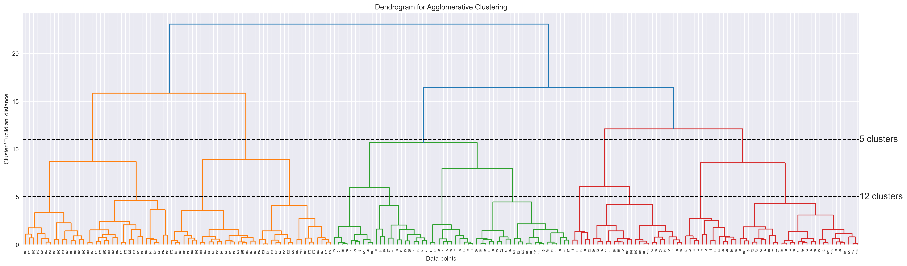
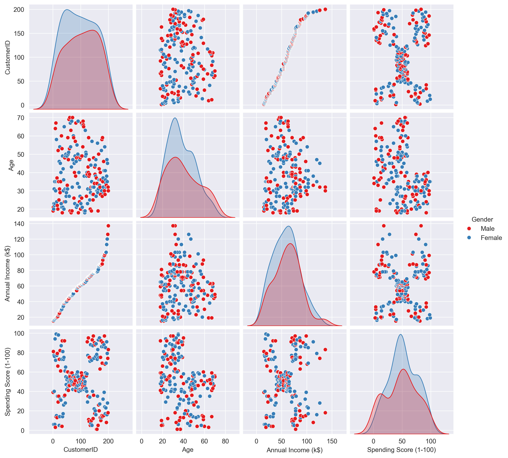
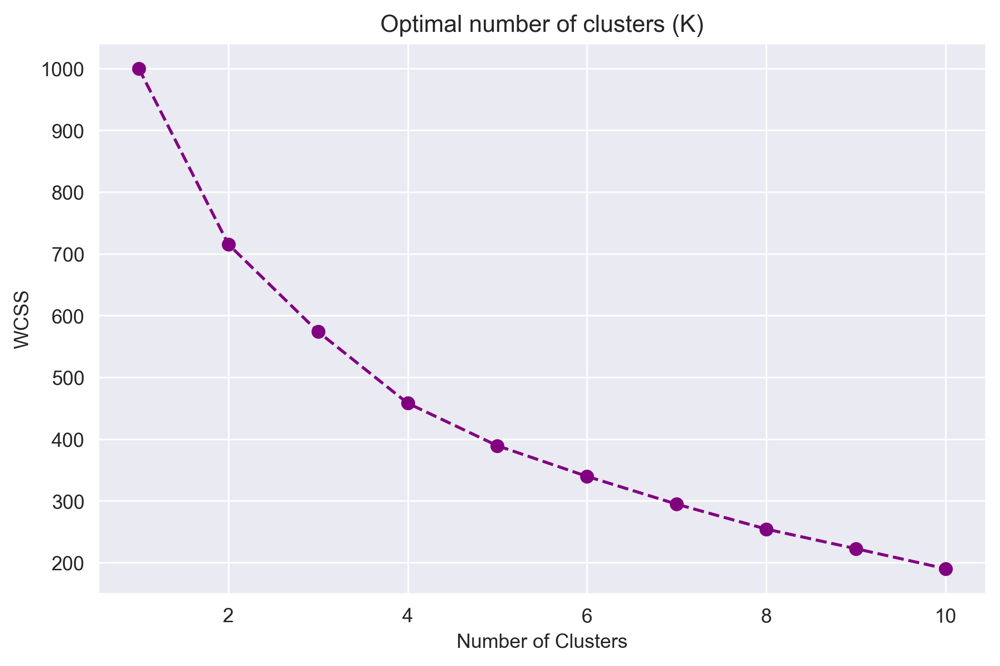

# 🛍️ Mall Basket Analysis

## Project Overview  
A clustering-based exploration of mall customers, aimed at uncovering shopper personas based on spending patterns and income. This project builds a foundation for more targeted marketing strategies by identifying customer groups using unsupervised learning techniques.

We compared multiple clustering algorithms—**K-Means**, **Agglomerative Clustering**, and **DBSCAN**—to segment customers and visualized the results with clean, interactive plots.

---

## 🚀 Code and Resources
- **Python Version**: 3.11  
- **Packages**: Install all dependencies via  
  ```bash
  pip install -r requirements.txt
  ```
- **Dataset**: [Mall Customers Dataset]([https://www.kaggle.com/vjchoudhary7/customer-segmentation-tutorial](https://www.kaggle.com/code/jeeelsheikh/clustering-analysis-on-mall-customers?select=Mall_Customers.csv))  
- **References**:
  - [Kaggle Clustering Tutorial](https://www.kaggle.com/code/jeeelsheikh/clustering-analysis-on-mall-customers?select=Mall_Customers.csv)
  - [Plotly Documentation](https://plotly.com/python/)

---

## 🧼 Data Preparation
- **Feature Selection**: Focused on `Annual Income (k$)` and `Spending Score (1–100)` for segmentation.
- **Normalization**: Scaled numeric features using `StandardScaler` for improved clustering.
- **Gender Encoding**: Converted `Gender` to numeric values for further analysis.
- **VIF Check**: Used Variance Inflation Factor to confirm feature independence.

---

## 🔍 Exploratory Data Analysis
- Visualized feature distributions with histograms and KDE plots.
- Explored relationships via scatter plots and pair plots.
- Used dendrograms to estimate cluster counts for hierarchical clustering.

### 📷 Dendrogram


### 📷 Pair Plot


---

## 🔢 Clustering Methods

### 1. K-Means
- Applied **Elbow Method** to select `k`.
- Evaluated using Within-Cluster Sum of Squares (WCSS).
- Best performing method by silhouette score.

### 📷 Elbow Plot


### 2. Agglomerative Clustering
- Visualized hierarchy via dendrograms.
- Used **Ward's linkage** for cluster formation.

### 3. DBSCAN
- Tuned `eps` and `min_samples` to discover density-based clusters.
- Naturally handled noise and outliers.

---

## 📊 Model Evaluation
- **Silhouette Score**:
  - K-Means: `0.441`
  - Agglomerative: `0.417`
  - DBSCAN: `0.417`

---

## 🎨 Visualizations
- Built interactive 2D scatter plots with **Plotly** for a clearer view of customer segments.
- Supplemented analysis with static pair plots and bar charts for distribution insights.

---

## 🧠 Future Work
- Incorporate **basket analysis** to tie segmentation back to product affinities.
- Explore **dimensionality reduction** techniques like PCA or t-SNE.
- Extend segmentation to include behavioral or transactional data if available.
